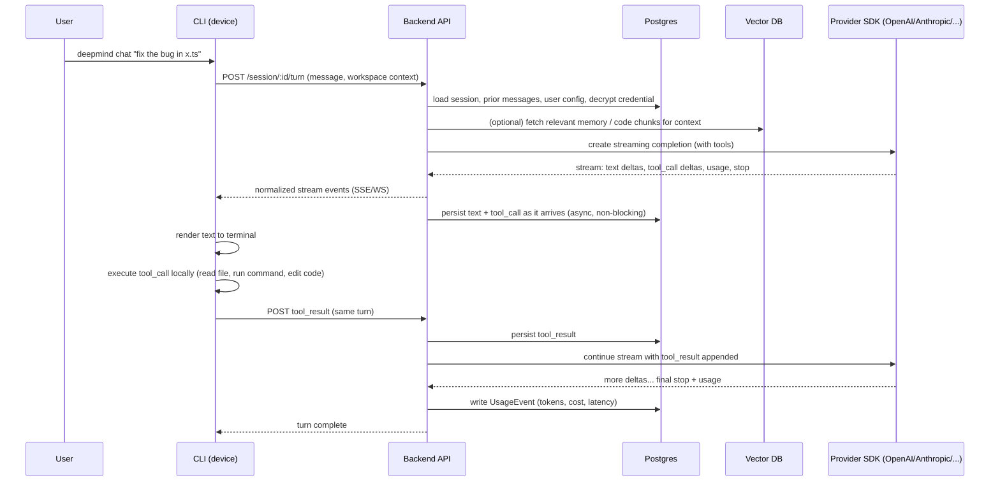

# Data Architecture Report: Sessions, Memory, Usage, Search History & Code Indexing

**Scope:** This report explains, in plain language, where every piece of data in the CodeAI harness comes from, how it should be parsed, and which database it belongs in — for the current system and for the agent-loop/session/memory/usage/search features that are not built yet. It ends with a section on future code indexing (Cursor-style) and a "what's wrong / what to fix" review.

This is a **design document**, not a changelog. No code was changed to produce it. Everything under "Proposed" has not been implemented — it is a recommendation grounded in the code that already exists in this repo.

---

## 1. What exists today (read from the actual code)

Before proposing anything new, here is what the repo already does, so the rest of this report builds on real ground:

| Piece | Where | What it does |
|---|---|---|
| CLI | `apps/cli` | Local device app (`deepmind` command). Has `login`, `logout`, `config`, `account`, `list`, `doctor`, `init`. Runs on the user's machine. |
| Backend API | `apps/api` | Express server. Routers for `cli` (device-code login), `account`, `config`, `credential`, `provider`, `status`. No chat/session/streaming endpoints exist yet. |
| Local device state | `packages/harness` | `Path`, `ConfigStore`, `AuthStore`, `VaultStore`, `CatalogStore` — manage files under `~/.deepmind/` (`config.json`, `auth.json`, `model.json`, a `session/` folder that is created but unused, `skills/`). |
| Shared contracts | `packages/protocol` | Zod schemas shared between CLI and API (`HarnessConfigSchema`, device-login schemas, credential schemas). This is the right place for the future streaming-event schema (see §4). |
| Relational database | `packages/database` (Prisma + Postgres) | `User`, `Session` (auth session, not agent session), `Account`, `Verification`, `DeviceCode`, `ProviderCatalog`, `ModelCatalog` (already has `inputCostPer1M`/`outputCostPer1M`!), `ProviderCredential` (encrypted API keys). |
| Web app | `apps/web` | Next.js app with `/signin`, `/signup`, `/device` (device-code approval flow) and `lib/api.ts`. |
| Infra | `infra/docker-compose.*` | Only **Postgres** is provisioned today. No Redis, no vector DB, no graph DB, no object storage. |

Two important facts fall out of this:

1. **There is no LLM SDK dependency anywhere yet** (`apps/api/package.json` has no `openai`/`@anthropic-ai/sdk`, no streaming/WebSocket library). The "call the provider and stream back" part of the architecture does not exist in code — it's the thing you're about to build.
2. **Security patterns already in place are good and should be reused**, not reinvented: the CLI never stores a provider API key locally — it POSTs it once to the backend, which encrypts it with AES‑256‑GCM using a per-user key derived (HKDF) from `VAULT_MASTER_KEY`, and stores only ciphertext in `ProviderCredential`. The CLI's own access token is kept in the OS keychain (`keytar`), not in a plaintext file — `auth.json` only stores a pointer to it. Apply this same "server holds the secret, client holds a reference" pattern to session/memory data (see §6).

---

## 2. The agent loop, end to end

Your architecture is: **agent loop runs on the CLI (the user's device) → CLI sends the turn to the backend → backend calls the provider SDK and streams the response back → CLI executes tool calls locally and streams results back to the backend → repeat until the turn finishes.**



The key architectural decision this diagram makes explicit: **the backend is the one persisting the transcript, not the CLI.** The reasoning is in §6.3 — read that before writing the streaming endpoint, because it's expensive to change after the fact.

---

## 3. Every kind of data, where it's born, and where it should live

| Data | Generated where | Frequency | Store |
|---|---|---|---|
| Session metadata (id, workspace path, provider, model, started/ended, status) | Backend, when CLI opens a turn | 1 per session | **Postgres** |
| Message transcript (user text, assistant text, tool calls, tool results, ordering) | Backend, parsed from the provider stream + CLI tool-result callbacks | Many per session | **Postgres** (source of truth); large tool output (big diffs, command logs) → object storage / blob column, referenced by pointer |
| Token usage & cost per LLM call | Backend, parsed from the final stream event (`usage` object) | 1 per LLM call (a session has many) | **Postgres**, append-only ledger |
| Long-term memory (facts, preferences, decisions worth recalling later) | Backend, either via an explicit `save_memory` tool call or a periodic summarizer job | Occasional | **Postgres** (the fact text + metadata) **+ Vector DB** (the embedding, for semantic recall) |
| Search history (semantic code search / web search tool invocations) | Backend, when a search-type tool runs | Per search call | **Postgres** (query, timestamp, tool, result count); embeddings only if you want "similar past searches" |
| Code index (future, §8) | Backend (or a local indexer that uploads diffs) | On file change | **Postgres** metadata + **Vector DB** embeddings (+ optional graph structure) |
| Auth, credentials, catalog | Backend (already built) | Low frequency | **Postgres** (already correct) |
| Local device config, cached model list, keychain token | CLI | Low frequency | Local files / OS keychain (already correct — this is per-device convenience state, not data that needs to survive a device loss) |

Rule of thumb used throughout this table: **anything that must survive a lost laptop, be resumable from another device, or be billed/audited belongs on the server (Postgres/Vector DB). Anything that's just "make this device faster next time" can stay local.**

---

## 4. How parsing actually works (the mechanics)

### 4.1 Normalize the provider stream once, at the boundary

OpenAI, Anthropic, and other providers each emit different streaming event shapes (SSE `data:` chunks with different field names for text deltas, tool-call deltas, and usage). Do **not** let CLI-side rendering code or persistence code each learn every provider's format.

Instead, write one adapter per provider in the backend that converts the raw stream into a single internal shape, defined once in `packages/protocol` (next to `HarnessConfigSchema`) — something like:

```
type AgentStreamEvent =
  | { type: "text_delta"; text: string }
  | { type: "tool_call"; id: string; name: string; args: unknown }
  | { type: "tool_result_request" }   // backend is waiting on the CLI
  | { type: "usage"; inputTokens: number; outputTokens: number; cachedTokens?: number }
  | { type: "error"; message: string }
  | { type: "done" };
```

This one normalized event stream is then **fanned out to two consumers**:
1. Sent live to the CLI (over SSE or WebSocket) for rendering and tool execution.
2. Written asynchronously to Postgres as it passes through the backend (one `Message`/`ToolCall` row per event group), so persistence never blocks the user-visible stream.

This is the single most important design decision in this report: parse provider-specific formats **exactly once**, in the backend adapter layer — everything downstream (CLI, database, memory extraction) consumes the same normalized shape regardless of which provider answered.

### 4.2 Usage & cost

The final event in a provider's stream carries token counts (e.g. OpenAI's `usage` chunk with `stream_options.include_usage`, or Anthropic's `message_stop`/`message_delta` usage field). The backend adapter turns this into the `usage` event above and, on receipt, immediately writes a `UsageEvent` row: `sessionId, userId, provider, modelId, inputTokens, outputTokens, cachedTokens, latencyMs, createdAt`.

Cost doesn't need a new pricing table — `ModelCatalog.inputCostPer1M` / `outputCostPer1M` already exist in the schema. Compute `cost = inputTokens/1e6 * inputCostPer1M + outputTokens/1e6 * outputCostPer1M` at write time and store it on the `UsageEvent` row too (denormalized on purpose — prices change over time, and a usage ledger must reflect the price *at the time of the call*, not today's price).

### 4.3 Tool calls and results

Tool **calls** are parsed the same way as text (they arrive as deltas in the provider stream, normalized to `tool_call` events, persisted as they arrive). Tool **results** are different: they're generated by the CLI, locally, after it actually runs the tool (reads a file, runs a shell command, applies an edit). The CLI must POST the result back to the backend as part of continuing the same turn. The backend persists it the moment it arrives and then re-submits the conversation (including the tool result) to the provider to continue the stream.

### 4.4 Memory

Memory is **not** a byproduct of parsing the raw stream — it needs a deliberate extraction step, because "what's worth remembering" isn't the same as "what was said." Two complementary approaches:
- **Explicit:** give the agent a `save_memory(text, scope)` tool. When the model calls it, that's an unambiguous, cheap-to-parse signal — just persist it (`ToolCall` handling from §4.3, no different).
- **Implicit fallback:** a background job (runs after a session ends, or every N turns) sends the transcript to a cheap/small model asking "what facts about this user/project are worth remembering," and writes the results the same way.

Either way, once you have a memory fact's text, do two things: (1) insert the row into Postgres (`MemoryFact`), (2) compute its embedding and store it in the vector DB keyed by the same id. Retrieval later is: embed the current query → vector search → fetch the matching `MemoryFact` rows from Postgres for the actual text.

### 4.5 Search history

Whenever a search-type tool runs (semantic code search, web search), log one row: `query, tool, sessionId, resultCount, createdAt`. This is a plain Postgres insert — no parsing complexity beyond reading the tool-call arguments you already have from §4.3. Only add a vector embedding of the query itself if you want a "you searched something like this before" feature — it's optional, not required for history to work.

---

## 5. Role of each database in this project

### Postgres — the system of record
Already set up via Prisma. This is where every fact that must be *correct*, *transactional*, and *queryable by relationship* lives: users, auth, device codes, provider/model catalog, encrypted credentials, and (proposed) sessions, messages, tool calls, usage events, memory facts, search history, code-index metadata. Postgres is chosen because this data is inherently relational (a session has many messages, a user has many sessions, a usage event references a model) and some of it (billing/usage) needs transactional correctness — you cannot afford to lose or double-count a usage row.

### Vector database — similarity search only
Purpose-built for "find the N most similar embeddings to this query embedding." It is not a replacement for Postgres — it never becomes the source of truth for anything; it always sits *next to* a Postgres row and is queried by embedding, then joined back to Postgres by id for the actual content. Three uses in this project: semantic memory recall, semantic code search for the future indexer (§8), and (optionally) "similar past search" lookups.

**Recommendation: don't stand up a separate vector database yet.** Start with the **`pgvector`** extension inside the same Postgres instance you already run (`infra/docker-compose.database.yml` just needs `pgvector/pgvector` image instead of plain `postgres:15`, or `CREATE EXTENSION vector;` if using a managed Postgres that supports it). This keeps you to one database to operate, one backup story, and one connection pool, while still giving you real ANN search via an `ivfflat`/`hnsw` index. Move to a dedicated vector DB (Qdrant, Weaviate, LanceDB) only when you actually hit a wall: very high query volume, need for per-tenant sharding, or embedding counts in the tens of millions. Nothing about the app code changes when you migrate later — it's an infra swap behind the same "fetch nearest embeddings" interface.

### "GraphQL" — flagging an ambiguity before recommending anything
Your message lists "vector db, graphql, postgres" as three storage technologies. These are two different things and it matters which you meant:

- **GraphQL** is an API query language/layer (an alternative to REST), not a database. It would sit in front of Postgres/vector DB, not replace them — e.g., the backend could expose a GraphQL endpoint instead of (or alongside) the REST routers it has today. This is a decision about *how the CLI/web app talk to the backend*, orthogonal to where data is stored.
- **Graph database** (Neo4j, Memgraph, etc.) *is* a storage technology, and it's the more likely intended meaning given the sentence's context (alongside "vector db" and "postgres"). It stores nodes and edges and is good at multi-hop relationship queries: "what depends on what," "which files import this symbol," "which memory facts relate to which project entities."

This report proceeds assuming you meant **graph database**, and covers where one would actually help (§8, code indexing). If you meant GraphQL-the-API-layer instead, that's a separate, smaller decision about the API surface and doesn't change anything about where session/memory/usage data is stored — happy to write a short addendum on that if so.

**Recommendation: don't stand up a graph database yet either.** A single repo's dependency/symbol graph is not usually large enough to need a dedicated graph engine — an adjacency-list table in Postgres (`CodeEdge(fromChunkId, toChunkId, kind)`) answers "what calls this function" and "what does this file import" perfectly well with a recursive CTE, up to real-world repo sizes. Reach for Neo4j-class tooling only if you later need deep multi-hop graph queries (5+ hops, graph algorithms like PageRank/centrality over the codebase) that become slow in Postgres — that's a scale problem you'll be able to see clearly once code indexing exists and is used for a while, not something to pre-build for.

### Local files / OS keychain (CLI side, already built)
Per-device convenience state only: current config, cached model catalog, a pointer to the auth token (the token itself lives in the OS keychain via `keytar`). None of this is "session data" in the sense this report is about — losing it just means the CLI re-fetches from the backend or asks the user to log in again. Keep it that way; don't let session/message/memory data leak into these local files, or resuming from a second device breaks.

---

## 6. Proposed Postgres schema additions

Illustrative field lists (Prisma-style), not ready-to-apply migrations — sized to match the existing schema's conventions (uuid ids, `createdAt`/`updatedAt`, relations to `User`).

```prisma
model AgentSession {
  id           String   @id @default(uuid())
  userId       String
  workspaceRoot String
  providerId   String
  modelId      String
  title        String?          // derived from first user message, for the resume list
  status       String           // "active" | "completed" | "errored"
  createdAt    DateTime @default(now())
  updatedAt    DateTime @updatedAt
  messages     Message[]
  usageEvents  UsageEvent[]
}

model Message {
  id         String   @id @default(uuid())
  sessionId  String
  session    AgentSession @relation(fields: [sessionId], references: [id], onDelete: Cascade)
  role       String       // "user" | "assistant" | "tool"
  content    String?      // text content
  toolCalls  ToolCall[]
  createdAt  DateTime @default(now())

  @@index([sessionId, createdAt])
}

model ToolCall {
  id         String   @id @default(uuid())
  messageId  String
  message    Message  @relation(fields: [messageId], references: [id], onDelete: Cascade)
  name       String
  args       Json
  result     Json?          // small results inline; large ones store a pointer instead
  resultRef  String?        // pointer to blob storage for large output
  durationMs Int?
  createdAt  DateTime @default(now())
}

model UsageEvent {
  id            String   @id @default(uuid())
  sessionId     String
  session       AgentSession @relation(fields: [sessionId], references: [id], onDelete: Cascade)
  userId        String
  providerId    String
  modelId       String
  inputTokens   Int
  outputTokens  Int
  cachedTokens  Int      @default(0)
  costUsd       Decimal  @db.Decimal(10, 6)
  latencyMs     Int
  createdAt     DateTime @default(now())

  @@index([userId, createdAt])
}

model MemoryFact {
  id            String   @id @default(uuid())
  userId        String
  scope         String        // "global" | workspaceRoot
  text          String
  sourceSessionId String?
  embeddingId   String?       // pointer to the vector store row
  createdAt     DateTime @default(now())

  @@index([userId, scope])
}

model SearchHistoryEntry {
  id         String   @id @default(uuid())
  userId     String
  sessionId  String?
  tool       String        // "code_search" | "web_search"
  query      String
  resultCount Int
  createdAt  DateTime @default(now())

  @@index([userId, createdAt])
}
```

With `pgvector`, the embedding tables can live in the same database, e.g. `MemoryEmbedding(id, vector vector(1536))` referenced by `MemoryFact.embeddingId` — no cross-database joins needed while you're on the pgvector approach from §5.

---

## 7. Resuming a previous session

Because the backend (not the CLI) persists the transcript, resuming works from any device once logged in:

1. `deepmind list sessions` → `GET /api/v1/session?limit=20` → backend reads `AgentSession` rows (+ latest message preview) for the authenticated user from Postgres.
2. `deepmind resume <sessionId>` → `GET /api/v1/session/:id/messages` → backend returns the full `Message`/`ToolCall` history in order.
3. CLI reconstructs a local view (for display) and sends the *next* turn tagged with the same `sessionId`; the backend appends new messages to the existing session and continues exactly as in §2.

This only works cleanly if step 1's data actually lives server-side — which is the reason §2 and §6.3 insist the backend, not the CLI, is authoritative for the transcript.

---

## 8. Code indexing (Cursor-style) — for later

This section answers your question about the future code-index feature specifically: what it is, where it lives, whether it needs to persist, and what it's for. It is **not** something to build before the session/memory/usage foundation above exists — it reuses the same vector infrastructure, so build it second.

**What it is:** breaking the codebase into chunks (functions, classes, or fixed-size text windows via a tool like tree-sitter), computing an embedding per chunk, and storing enough metadata (file path, line range, symbol name, a content hash) to (a) find semantically relevant code for a prompt without stuffing whole files into context, and (b) answer structural questions ("who calls this function," "what imports this file") fast.

**Where it should run:** keep the same trust boundary you already use for the LLM calls — the CLI never talks to the embedding model directly. The CLI walks the workspace, hashes each file's content, and uploads only *changed* files/chunks to a backend indexing endpoint; the backend computes embeddings (reusing the provider credential system already built) and writes them to storage. This avoids embedding API keys ever touching the CLI, matching the existing "server holds the secret" pattern from §1.

**Does it need to persist? Yes — always.** Re-embedding a real codebase on every command would be slow and expensive. Persist:
- **Postgres**: `CodeFile(repoId, path, contentHash, lastIndexedAt)` and `CodeChunk(fileId, symbolName, startLine, endLine, contentHash)` — this is what lets you do *incremental* re-indexing: on each run, hash every file, diff against stored hashes, and only re-embed the files that actually changed.
- **Vector DB (pgvector to start, per §5)**: one embedding per `CodeChunk`, looked up by similarity, then joined back to Postgres for the actual file/line/symbol.
- **Graph structure (optional, deferred per §5)**: if/when you need "what calls this" style queries, a simple `CodeEdge(fromChunkId, toChunkId, kind)` adjacency table in Postgres answers it via a recursive query; only reach for a dedicated graph database if that stops being fast enough.
- Scope every row by `userId` + a `repoId` (a hash of the git remote URL, or the workspace root if there's no remote) — the backend serves many users/repos, so isolation matters here the same way it already matters for `ProviderCredential`.

**Local vs. server:** a hybrid is worth it. Keep a small local cache (e.g., a SQLite/embedded vector file under `~/.deepmind/session/<repoId>/index`) so the CLI can skip re-uploading a file-hash manifest that hasn't changed and get instant results while offline, but treat the **server copy as authoritative** — same reasoning as transcripts: if the index only lived on one laptop, `resume` from another device (or a teammate opening the same repo) would have to rebuild it from scratch.

**What it's for:** faster and cheaper prompts (retrieve only the relevant few chunks instead of pasting whole files), grounding for tool calls like "find definition"/"find usages" without a slow full-repo grep on every call, and fewer hallucinated file paths because the model is working from real retrieved snippets instead of guessing. It directly improves both quality and cost of the agent loop once repos get large enough that they don't fit in context.

---

## 9. What's missing / what to fix

This is a review of the current state against the architecture above, in priority order.

1. **Nothing exists yet for chat/session/usage/memory/search** — `program.ts` has these as literal comments (`// -- memory`, `// -- search`, `// -- usage`, `// -- run`, `// -- session`, `// -- resume`...) and there's no streaming endpoint, no LLM SDK dependency, and no relevant Prisma models. This report's §6 schema and §2 flow are the gap to fill — this isn't a bug, it's the actual next milestone.

2. **Decide backend-vs-CLI transcript authority before writing the streaming endpoint.** This is the one decision in this whole report that's expensive to reverse once code is written around it. §2 and §6.3 recommend backend-authoritative persistence (the backend captures the provider stream as it proxies it, and receives tool results explicitly from the CLI) specifically because: it makes cross-device resume possible, it means a crashed/offline CLI doesn't lose the transcript, and it keeps usage/billing data trustworthy (a client can't under-report its own usage). Don't let this get decided implicitly by whichever code happens to get written first.

3. **Define the normalized stream-event schema in `packages/protocol` before integrating any provider SDK** (§4.1). If provider-specific parsing leaks into the CLI's renderer or into the persistence code instead of being isolated to one backend adapter layer, you'll end up rewriting both when you add a second provider.

4. **Infra currently provisions only Postgres** (`infra/docker-compose.database.yml`). Before building §6-8, add the `pgvector` extension to that same Postgres instance rather than introducing a new service — see §5 for why a separate vector DB isn't needed yet. No graph database is needed yet either.

5. **No streaming transport decision made yet** — SSE vs WebSocket. If the API ever runs as more than one instance behind a load balancer, a long-lived stream needs either sticky sessions or a shared pub/sub (e.g., Redis) so the instance handling the CLI's connection can receive events published by whichever instance/worker is talking to the provider. Not urgent at a single-instance scale, but worth deciding deliberately rather than discovering it under load.

6. **Reuse `ModelCatalog.inputCostPer1M`/`outputCostPer1M` for cost calculation** (§4.2) instead of introducing a second pricing table — this data already exists and was clearly added with usage tracking in mind.

7. **Existing security patterns are good — keep applying them.** Access tokens in the OS keychain, provider API keys never touching the CLI in plaintext, per-user encryption keys derived via HKDF from a single master key, `keyVersion` already on `ProviderCredential` for future key rotation. Apply the same instinct to session/memory data: nothing sensitive (transcripts, memory facts) should end up cached in a plaintext local file the way credentials correctly avoid it today.

8. **Key rotation for `VAULT_MASTER_KEY` isn't implemented** — the `keyVersion` column shows it was anticipated, but there's no rotation code path yet. Not urgent while there's a single key version in production, but worth tracking as a known gap rather than an oversight, since a compromised master key currently has no remediation path other than a full re-encryption of every credential.

---

## 10. Summary

- **Postgres** is and stays the backbone: everything relational and everything that must be correct (auth, catalog, credentials, and — once built — sessions, messages, tool calls, usage ledger, memory facts, search history, code-index metadata).
- **Vector search** starts as `pgvector` inside that same Postgres instance; graduate to a dedicated vector database only under real scale pressure.
- **Graph database** is not needed yet; a Postgres adjacency table covers code-dependency queries until multi-hop graph queries genuinely become a bottleneck. ("GraphQL" the API layer, if that's what was meant, is a separate and orthogonal decision about the API surface, not storage.)
- **Local device files** (CLI side) stay limited to convenience state — config, cached catalog, a keychain pointer — never the transcript, memory, or usage data that needs to survive a lost device or support cross-device resume.
- The one decision to lock in **before** writing any streaming code: the **backend persists the transcript as it proxies the provider stream**; the CLI executes tools locally and reports results back, but is never the system of record.
- **Code indexing** is a second-phase feature that reuses the same Postgres + vector infrastructure — build it after the session/memory/usage foundation exists, not before.
