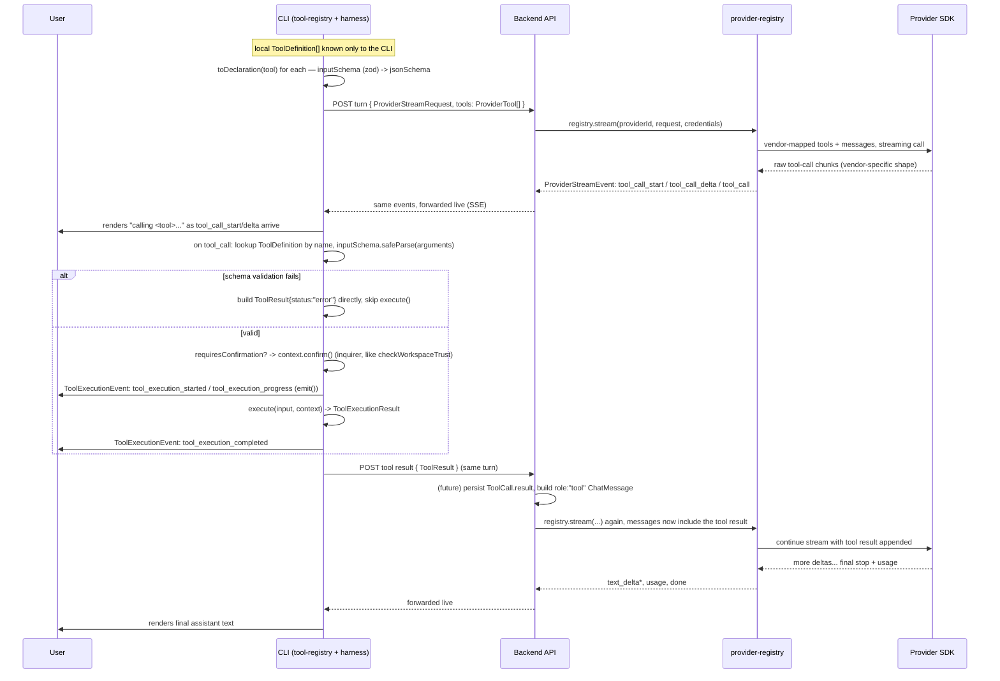

# Provider Registry + Tool Contract: `packages/provider-registry`, `packages/tool-registry`, and the normalized stream/tool types in `packages/protocol`

## Context

Today the repo has zero LLM SDK dependency anywhere (confirmed by scanning every `package.json` and `bun.lock`) — the "call the provider and stream back" layer described in `docs/data-architecture-report.md` §2/§4 doesn't exist yet. The CLI (`apps/cli`, commander-based) has `// -- chat`, `// -- run`, `// -- session` etc. as literal placeholder comments in `program.ts`; nothing calls a provider yet.

The architectural rule this task exists to lock in (per the report, §9.3, and the user's own framing): **provider-specific stream parsing happens exactly once, in a backend-owned adapter layer** — never in the CLI, never duplicated per call site. OpenAI, Anthropic, and Google each emit a different streaming wire shape (different field names for text deltas, tool-call argument deltas, usage). This task builds:

1. A new package, **`packages/provider-registry`**, holding one adapter per provider (openai / anthropic / google) — each wraps the vendor's own SDK and exposes a `stream()` function that turns the vendor's raw stream into one shared, normalized event shape.
2. The **shared provider-stream contract** — both the *input* (`ProviderStreamRequest`, what goes into `stream()`) and the *output* (`ProviderStreamEvent`, each item the stream yields) — defined once in `packages/protocol`, so it is trivially importable by `packages/harness` (which already does `export * from "@workspace/protocol"`) and, later, by `apps/api` and `apps/cli` without redefining anything.
3. A parallel **tool declaration/execution contract**: wire-safe tool types (`ToolDeclarationSchema`, `ToolResultSchema`, `ToolExecutionEvent`) in `packages/protocol`, plus a second new, types-only package, **`packages/tool-registry`**, holding the runtime `ToolDefinition`/`ToolExecutionContext`/`ToolExecutionResult` shapes that can't be Zod schemas because they carry an actual `execute()` function. No `ToolRegistry` class or built-in tools yet — types only, per the user's explicit "we will create the tool registry later."
4. A detailed study document (`docs/provider-registry-architecture.md`, same style/rigor as the existing `docs/data-architecture-report.md`) explaining every type — both provider-stream and tool contract — the per-provider raw→normalized mapping tables, the full tool-call flow, and exactly what's *not* built yet (the API endpoint, the harness SSE client, the CLI chat loop, the actual tool registry/tools) with pointers to where those attach later.

**Explicitly out of scope for this task** (confirmed with the user): no new `apps/api` endpoint, no harness HTTP/SSE client, no CLI `chat` command, no DB schema changes, no `ToolRegistry` implementation or concrete tools (file/shell/search). `ProviderCatalog` / `ModelCatalog` / `ProviderCredential` already exist in `packages/database/prisma/schema.prisma` and need no changes — this task only adds the pure adapter/registry logic and its wire contract, verified via typecheck + unit tests that mock each vendor SDK's stream shape (no live API keys touch this environment).

---

## 1. New types in `packages/protocol`

Add two new files (protocol has no build step — `exports["."]` points straight at `src/index.ts`, so these are consumed as raw TS by every workspace package immediately):

### `packages/protocol/src/chat.ts` — the *input* side

```ts
import { ProviderToolSchema } from "./tool.js"; // §3 — narrow, vendor-facing projection of ToolDeclarationSchema

export const ProviderIdSchema = z.enum(["openai", "anthropic", "google"]);
// matches the providerId values already seeded in packages/database/src/seed.ts

export const ChatRoleSchema = z.enum(["system", "user", "assistant", "tool"]);

export const ToolCallSchema = z.object({
  id: z.string().min(1),
  name: z.string().min(1),
  arguments: z.record(z.string(), z.unknown()), // parsed JSON args, not a raw string
});

export const ChatMessageSchema = z.object({
  role: ChatRoleSchema,
  content: z.string().optional(),        // text content (user/assistant/system/tool result text)
  toolCalls: z.array(ToolCallSchema).optional(),  // present on assistant messages that requested tools
  toolCallId: z.string().optional(),     // present on role:"tool" messages — which call this answers
  name: z.string().optional(),           // tool name, present on role:"tool" messages
});

export const ProviderStreamRequestSchema = z.object({
  providerId: ProviderIdSchema,
  modelId: z.string().min(1),
  systemPrompt: z.string().optional(),
  messages: z.array(ChatMessageSchema).min(1),
  tools: z.array(ProviderToolSchema).default([]),
  temperature: z.number().min(0).max(2).optional(),
  maxOutputTokens: z.number().int().positive().optional(),
});
```

### `packages/protocol/src/stream-event.ts` — the *output* side

A discriminated union on `type`, close to the report's §4.1 sketch but split `tool_call` into start/delta/complete — necessary because OpenAI and Anthropic both stream tool-call arguments as incremental JSON-string fragments that aren't valid JSON until the block closes; Google emits function calls as a single atomic chunk, so its adapter just emits `tool_call_start` immediately followed by the complete `tool_call`.

```ts
export const TextDeltaEventSchema = z.object({ type: z.literal("text_delta"), text: z.string() });
export const ToolCallStartEventSchema = z.object({ type: z.literal("tool_call_start"), id: z.string(), name: z.string() });
export const ToolCallDeltaEventSchema = z.object({ type: z.literal("tool_call_delta"), id: z.string(), argsDelta: z.string() }); // raw partial JSON text, for live rendering only
export const ToolCallEventSchema = z.object({ type: z.literal("tool_call"), id: z.string(), name: z.string(), arguments: z.record(z.string(), z.unknown()) }); // complete + parsed — this is what a consumer actually executes
export const UsageEventSchema = z.object({ type: z.literal("usage"), inputTokens: z.number().int().nonnegative(), outputTokens: z.number().int().nonnegative(), cachedTokens: z.number().int().nonnegative().default(0) });
export const ErrorEventSchema = z.object({ type: z.literal("error"), message: z.string(), code: z.string().optional(), retryable: z.boolean().default(false) });
export const DoneEventSchema = z.object({ type: z.literal("done"), stopReason: z.enum(["end_turn", "tool_use", "max_tokens", "stop_sequence", "error"]) });

export const ProviderStreamEventSchema = z.discriminatedUnion("type", [
  TextDeltaEventSchema, ToolCallStartEventSchema, ToolCallDeltaEventSchema,
  ToolCallEventSchema, UsageEventSchema, ErrorEventSchema, DoneEventSchema,
]);
export type ProviderStreamEvent = z.infer<typeof ProviderStreamEventSchema>;
```

Update `packages/protocol/src/index.ts` to add `export * from "./chat.js"; export * from "./stream-event.js";`. No changes needed in `packages/harness` — it already re-exports all of `@workspace/protocol`, so these types are immediately available there too, satisfying "used by the harness also."

> **Note on `tools` in `ProviderStreamRequestSchema`**: §3 below introduces a richer `ToolDeclarationSchema` (in a new `tool.ts`). `ProviderStreamRequestSchema.tools` is typed as `ProviderToolSchema`, a **narrow `.pick()` projection** of that (`name`/`description`/`jsonSchema` only — a vendor SDK doesn't need to know about `sideEffect`/`requiresConfirmation`), not a separate parallel type. See §3 for why.

---

## 2. New package: `packages/provider-registry`

Follows the exact zero-build convention of `packages/protocol`/`packages/harness` (`exports["."]: "./src/index.ts"`, `tsconfig.json` extending `@workspace/typescript-config/base.json` with `noEmit: true`, `typecheck` script only — no bundler).

```
packages/provider-registry/
  package.json          # @workspace/provider-registry
  tsconfig.json
  src/
    index.ts            # exports providerRegistry, ProviderRegistry, adapter classes, error types
    types.ts            # ProviderAdapter interface, ProviderCredentials type (local — not a wire contract)
    errors.ts           # ProviderError: normalizes vendor SDK errors (auth, rate-limit, invalid-request, context-length)
    registry.ts          # ProviderRegistry class, pre-registers the 3 adapters, keyed by ProviderIdSchema
    providers/
      openai.ts          # OpenAIAdapter — wraps `openai` SDK
      anthropic.ts        # AnthropicAdapter — wraps `@anthropic-ai/sdk`
      google.ts            # GoogleAdapter — wraps `@google/genai`
  src/__tests__/
    openai.test.ts, anthropic.test.ts, google.test.ts, registry.test.ts
```

**`types.ts`**

```ts
import type { ProviderStreamRequest, ProviderStreamEvent, ProviderId } from "@workspace/protocol";

export interface ProviderCredentials { apiKey: string; baseUrl?: string; }

export interface ProviderAdapter {
  readonly id: ProviderId;
  stream(request: ProviderStreamRequest, credentials: ProviderCredentials): AsyncGenerator<ProviderStreamEvent, void, unknown>;
}
```

**`registry.ts`**

```ts
export class ProviderRegistry {
  private readonly adapters = new Map<ProviderId, ProviderAdapter>();
  register(adapter: ProviderAdapter) { this.adapters.set(adapter.id, adapter); }
  get(providerId: ProviderId): ProviderAdapter { /* throw ProviderNotRegisteredError if missing */ }
  stream(providerId: ProviderId, request: ProviderStreamRequest, credentials: ProviderCredentials) {
    return this.get(providerId).stream(request, credentials);
  }
}
export const providerRegistry = new ProviderRegistry();
providerRegistry.register(new OpenAIAdapter());
providerRegistry.register(new AnthropicAdapter());
providerRegistry.register(new GoogleAdapter());
```

**Each `providers/<name>.ts`** is self-contained: request mapping (normalized `ChatMessage[]`/`ToolDefinition[]` → vendor format), the actual SDK streaming call, and response mapping (vendor chunk → `ProviderStreamEvent`) all live in one file per provider, matching "each provider has a stream function."

- **`openai.ts`** — `client.chat.completions.create({ stream: true, stream_options: { include_usage: true }, tools, messages, ... })`. Accumulate `tool_calls[].function.arguments` string deltas per tool-call index/id (emit `tool_call_start` on first sight of an id, `tool_call_delta` per fragment); on `finish_reason` present, `JSON.parse` the accumulated buffer and emit the complete `tool_call`. Final `usage` chunk → `usage` event; stream end → `done` with `stopReason` mapped from `finish_reason` (`stop`→`end_turn`, `tool_calls`→`tool_use`, `length`→`max_tokens`).
- **`anthropic.ts`** — `client.messages.stream({ system, messages, tools, ... })`, which already emits typed SDK events (`content_block_start`, `content_block_delta` with `text_delta`/`input_json_delta`, `content_block_stop`, `message_delta` carrying `usage`, `message_stop`). These map almost 1:1 onto the normalized union.
- **`google.ts`** — `ai.models.generateContentStream({ model, contents, config: { tools, systemInstruction, ... } })`. Each chunk's `candidates[0].content.parts` may hold `text` (→ `text_delta`) or a `functionCall` (atomic — emit `tool_call_start` immediately followed by the complete `tool_call`, no delta events). `usageMetadata` on the final chunk → `usage` + `done`.

**`errors.ts`** — `ProviderError extends Error { code, retryable, providerId }`; each adapter wraps its vendor SDK's thrown errors (auth failure, 429 rate limit, context-length-exceeded) into this shape, and the adapter's `stream()` catches and yields a normalized `error` event (with `retryable` set appropriately) rather than throwing raw vendor exceptions past the boundary — so nothing downstream ever needs a provider-specific `catch`.

**`package.json` dependencies to add** (resolve latest via `bun add`, don't hand-pin unverified versions): `openai`, `@anthropic-ai/sdk`, `@google/genai`, plus `"@workspace/protocol": "*"` and `zod`. Dev deps mirror `apps/cli`'s test setup: `@workspace/jest-presets`, `jest`, `ts-jest`, `@jest/globals`, `@workspace/typescript-config`, `typescript`; `"jest": { "preset": "@workspace/jest-presets/node" }` in `package.json`, matching the existing `packages/jest-presets/node/jest-preset.js` (ts-jest, ESM, ext-less relative imports).

---

## 3. Tool declaration & execution contract

Two layers, same split as providers: the **wire-safe, advertisable/serializable parts** go in `packages/protocol` (new `tool.ts`); the **runtime object with an actual `execute` function** (not Zod-representable) goes in a new, types-only `packages/tool-registry` package. This task defines the types only — no registry class, no built-in tools (file read/write, shell, search, etc.) — per the user's explicit "we will create the tool registry later."

### 3.1 `packages/protocol/src/tool.ts` — wire-safe tool types

```ts
export const ToolSideEffectSchema = z.object({
  readOnly: z.boolean().default(false),       // never mutates anything (matches MCP's readOnlyHint convention)
  destructive: z.boolean().default(true),     // can this cause irreversible loss (rm, overwrite, force-push)
  idempotent: z.boolean().default(false),     // safe to auto-retry after a timeout/network error
  requiresNetwork: z.boolean().default(false),
});

export const ToolExecutionModeSchema = z.enum(["sync", "streaming"]);
// "sync": a single ToolResult once execute() resolves.
// "streaming": execute() also calls context.emit(...) with ToolExecutionEvent progress before resolving
//              (e.g. a long shell command). Same execute() signature either way — see §3.2.

export const ToolExecutionTargetSchema = z.enum(["cli-local", "backend-remote"]);
// Everything today runs "cli-local" (report §2: "CLI executes tool_call locally"). "backend-remote" is
// reserved for future tools the backend runs itself (e.g. semantic code search over an index it owns,
// per data-architecture-report.md §4.5/§8) — CLI just relays these, never executes them.

export const ActorSchema = z.object({
  type: z.enum(["user", "agent", "system"]),  // "user": direct CLI invocation; "agent": normal LLM tool_call;
  id: z.string().optional(),                   // "system": automated jobs (e.g. the §4.4 memory summarizer)
});

/** The declarative, advertisable shape of a tool — no function, fully JSON-serializable. */
export const ToolDeclarationSchema = z.object({
  name: z.string().min(1),
  description: z.string().min(1),
  jsonSchema: z.record(z.string(), z.unknown()),   // derived from a zod schema via z.toJSONSchema() — see §3.2
  sideEffect: ToolSideEffectSchema,
  executionMode: ToolExecutionModeSchema.default("sync"),
  executionTarget: ToolExecutionTargetSchema.default("cli-local"),
  requiresConfirmation: z.boolean().default(false),
  timeoutMs: z.number().int().positive().optional(),
  version: z.string().default("1"),
});

/** What actually goes into a provider's function-calling request — vendor SDKs need none of the rest. */
export const ProviderToolSchema = ToolDeclarationSchema.pick({ name: true, description: true, jsonSchema: true });

export const ToolResultStatusSchema = z.enum(["success", "error", "denied", "timeout", "cancelled"]);

/** What the CLI POSTs back to the backend after running a tool, and what becomes the next role:"tool" ChatMessage. */
export const ToolResultSchema = z.object({
  toolCallId: z.string().min(1),          // correlates to ToolCallSchema.id from the provider's tool_call event
  name: z.string().min(1),
  status: ToolResultStatusSchema,
  content: z.string(),                    // human/LLM-readable text — this is what round-trips back into the conversation
  isError: z.boolean().default(false),
  durationMs: z.number().int().nonnegative(),
  truncated: z.boolean().default(false),  // true if `content` was shortened to fit the context budget
  resultRef: z.string().optional(),       // pointer to blob storage for large output (report §3/§6 ToolCall.resultRef)
  metadata: z.record(z.string(), z.unknown()).optional(), // e.g. exit code, files touched, byte size
});

/** The wire-safe subset of execution context — correlates a tool run to a session/turn, nothing runtime-only. */
export const ToolInvocationSchema = z.object({
  sessionId: z.string(),
  turnId: z.string(),
  toolCallId: z.string(),
  actor: ActorSchema,
  workspaceRoot: z.string(),
  requestedAt: z.iso.datetime(),
});

/** Execution-lifecycle stream — distinct from ProviderStreamEvent: nothing here comes from the vendor SDK,
 *  it's generated CLI-side while running a tool, for rendering to the user and optional backend mirroring. */
export const ToolExecutionStartedEventSchema = z.object({ type: z.literal("tool_execution_started"), toolCallId: z.string() });
export const ToolExecutionProgressEventSchema = z.object({ type: z.literal("tool_execution_progress"), toolCallId: z.string(), message: z.string() });
export const ToolExecutionCompletedEventSchema = z.object({ type: z.literal("tool_execution_completed"), toolCallId: z.string(), result: ToolResultSchema });
export const ToolExecutionFailedEventSchema = z.object({ type: z.literal("tool_execution_failed"), toolCallId: z.string(), message: z.string() });
export const ToolConfirmationRequiredEventSchema = z.object({ type: z.literal("tool_confirmation_required"), toolCallId: z.string(), prompt: z.string() });
export const ToolConfirmationResolvedEventSchema = z.object({ type: z.literal("tool_confirmation_resolved"), toolCallId: z.string(), approved: z.boolean() });

export const ToolExecutionEventSchema = z.discriminatedUnion("type", [
  ToolExecutionStartedEventSchema, ToolExecutionProgressEventSchema, ToolExecutionCompletedEventSchema,
  ToolExecutionFailedEventSchema, ToolConfirmationRequiredEventSchema, ToolConfirmationResolvedEventSchema,
]);
export type ToolExecutionEvent = z.infer<typeof ToolExecutionEventSchema>;
```

Add `export * from "./tool.js";` to `packages/protocol/src/index.ts` (ordered before `chat.js` in the barrel, since `chat.ts` imports `ProviderToolSchema` from it).

> **On "transaction"**: the user's ask mentioned actor/session/transaction — a DB transaction is a Prisma/Postgres implementation detail (per `data-architecture-report.md` §6, not a cross-layer contract concern), so it isn't modeled here. The cross-layer "unit of work" is the **tool invocation** (`toolCallId`, one call → one result), which `ToolInvocationSchema`/`ToolResultSchema` already cover.

### 3.2 `packages/tool-registry` — runtime-only types (no registry class yet)

Same zero-build package convention as `provider-registry`. This package holds the parts that **cannot** be a Zod schema (an actual function) plus the zod-schema-as-source-of-truth pattern:

```
packages/tool-registry/
  package.json          # @workspace/tool-registry
  tsconfig.json
  src/
    index.ts            # exports ToolDefinition, ToolExecutionContext, ToolExecutionResult, toDeclaration()
    types.ts
```

**`types.ts`**

```ts
import type { z } from "zod";
import type {
  ToolSideEffect, ToolExecutionMode, ToolExecutionTarget, Actor,
  ToolDeclaration, ToolExecutionEvent, ToolResult, ToolResultStatus,
} from "@workspace/protocol";

/** The full local tool object a CLI-side registry will hold. `inputSchema` is the source of truth —
 *  `jsonSchema` on the wire declaration is *derived* from it via zod's native `z.toJSONSchema()` (zod v4,
 *  already a dependency here — no separate zod-to-json-schema package needed). */
export interface ToolDefinition<TInput = unknown, TOutput = unknown> {
  name: string;
  description: string;
  inputSchema: z.ZodType<TInput>;
  sideEffect: ToolSideEffect;
  executionMode: ToolExecutionMode;
  executionTarget: ToolExecutionTarget;
  requiresConfirmation: boolean;
  timeoutMs?: number;
  execute(input: TInput, context: ToolExecutionContext): Promise<ToolExecutionResult<TOutput>>;
}

export interface ToolExecutionContext {
  actor: Actor;
  sessionId: string;
  turnId: string;
  toolCallId: string;
  workspaceRoot: string;
  cwd: string;
  trustLevel: "trusted" | "untrusted";       // ties into apps/cli's existing checkWorkspaceTrust (hook.ts)
  signal: AbortSignal;                        // cancellation — turn aborted, user Ctrl+C
  emit(event: ToolExecutionEvent): void;      // progress -> rendered to the terminal; §4 covers what consumes this
  confirm(message: string): Promise<boolean>; // reuses the inquirer confirm pattern already in commands/hook.ts
  backend?: { baseUrl: string; accessToken: string }; // only set for executionTarget:"backend-remote" tools
}

export interface ToolExecutionResult<TOutput = unknown> {
  status: ToolResultStatus;
  output: TOutput;             // structured result, for the tool's own caller / future persistence
  content: string;              // what gets sent back to the LLM as the tool result text
  isError: boolean;
  durationMs: number;
  truncated?: boolean;
  resultRef?: string;
  metadata?: Record<string, unknown>;
}

/** Derives the wire-safe ToolDeclaration from a local ToolDefinition — the one place inputSchema -> jsonSchema happens. */
export function toDeclaration(tool: ToolDefinition): ToolDeclaration {
  return {
    name: tool.name,
    description: tool.description,
    jsonSchema: z.toJSONSchema(tool.inputSchema),
    sideEffect: tool.sideEffect,
    executionMode: tool.executionMode,
    executionTarget: tool.executionTarget,
    requiresConfirmation: tool.requiresConfirmation,
    timeoutMs: tool.timeoutMs,
    version: "1",
  };
}

/** Converts a local ToolExecutionResult into the wire ToolResult sent back to the backend. */
export function toToolResult(toolCallId: string, name: string, result: ToolExecutionResult): ToolResult {
  return {
    toolCallId, name, status: result.status, content: result.content, isError: result.isError,
    durationMs: result.durationMs, truncated: result.truncated ?? false,
    resultRef: result.resultRef, metadata: result.metadata,
  };
}
```

`package.json`: `"@workspace/tool-registry"`, depends on `@workspace/protocol` and `zod`, same jest/typecheck setup as `provider-registry`. Tests (`toDeclaration.test.ts`) just assert a sample zod object schema round-trips through `z.toJSONSchema()` into something a `ToolDeclarationSchema.parse()` accepts, and that `toToolResult()` maps every field correctly — no actual tool implementations to test yet.

---

## 4. Tool call flow, end to end



Two things worth calling out explicitly, since they answer "what does the backend do with the tool result further":

- **Backend-side, not built in this task**: once a `ToolResult` arrives, the backend's job (per `data-architecture-report.md` §4.3) is to persist it (`ToolCall.result`/`resultRef`), turn it into a `role:"tool"` `ChatMessage`, and call `registry.stream()` again with the extended `messages` array — the provider-registry itself is stateless per call, so "continuing a turn after a tool call" is just "call `stream()` again with a longer `messages` array," nothing provider-registry-specific to build for that.
- **User-visible streaming has two independent sources**, and a consumer must not conflate them: `ProviderStreamEvent` (from `packages/protocol/src/stream-event.ts`, §1) describes what the *model* is doing (talking, deciding to call a tool); `ToolExecutionEvent` (§3.1) describes what the *local execution* is doing (running, progressing, confirming) and never comes from the vendor SDK. Both are needed to render a coherent "the agent is now running `npm test`..." experience, but they are two separate discriminated unions with two separate `type` namespaces — do not merge them into one giant union, since only one of them can ever legitimately come from `apps/api`'s SSE forwarder and the other is purely local (until/unless a future task decides to also mirror `ToolExecutionEvent` to the backend for cross-device visibility, per `executionTarget` above).

---

## 5. Testing (no live API keys available in this environment)

Unit-test each adapter by mocking the vendor SDK client (jest module mock) to return a fake `AsyncIterable` shaped exactly like that vendor's real stream chunks (captured from each SDK's own TypeScript types), then asserting the adapter yields the correct, ordered `ProviderStreamEvent[]` — covering: plain text response, a tool call (args split across multiple delta chunks for OpenAI/Anthropic), usage numbers, and one error case (e.g. simulated 401/429) mapped to a `retryable` flag. `registry.test.ts` checks `get()` throws for an unregistered id and that all three adapters are pre-registered under the right `ProviderIdSchema` keys.

For `packages/tool-registry`: `toDeclaration.test.ts` builds a sample `ToolDefinition` with a nested zod object `inputSchema`, calls `toDeclaration()`, and asserts the result both matches `ToolDeclarationSchema.parse()` and that `ProviderToolSchema.parse(toolDeclaration)` (the narrow projection actually sent to providers) succeeds; `toToolResult.test.ts` checks field-by-field mapping including the `truncated` default.

Run via `bun run typecheck` and `bun test` in each package (or `turbo typecheck`/`turbo test` from the root, which picks up new workspace packages automatically — no `turbo.json` changes needed since `build`/`typecheck`/`test`/`lint` tasks already fan out via `dependsOn: ["^..."]`).

---

## 6. Study document: `docs/provider-registry-architecture.md`

Mirrors the tone/structure of `docs/data-architecture-report.md`. Sections:

1. **Why parse once, at the boundary** — restates the report's §4.1 rule, now made concrete with real code, for both the provider stream and the tool-execution stream.
2. **The provider contract, field by field** — every schema from §1, with a one-line rationale per field (e.g. why `tool_call_delta` carries raw text but `tool_call` carries parsed `arguments`; why `cachedTokens` defaults to 0 rather than being optional, since `ModelCatalog`/usage-ledger math in the report §4.2 needs a number, not `undefined`).
3. **Per-provider raw→normalized mapping tables** — one table per provider: vendor stream chunk/event name → normalized event(s) it produces, with a short annotated JSON example of each.
4. **The tool contract, field by field** — every schema from §3.1/§3.2: why `inputSchema` (zod) is the source of truth and `jsonSchema` is derived (`z.toJSONSchema()`, zod v4 native, no extra dependency); why `ProviderToolSchema` is a strict subset of `ToolDeclarationSchema`, not the same type; the `sideEffect`/`requiresConfirmation`/`executionTarget` fields and what CLI-side decision each one drives; why `ToolExecutionEvent` is a separate union from `ProviderStreamEvent` (§4 of the plan explains the "two independent streams" point — reproduce that reasoning here).
5. **Data flow diagrams** (mermaid) — the provider-stream sequence (registry.stream → vendor SDK → normalized event) and the full tool-call sequence from §4 of this plan, both explicitly marking which boxes exist today vs. which don't.
6. **What's intentionally not built here, and where it plugs in later** — the `apps/api` streaming endpoint (new router/controller/service, following the existing `provider.router.ts`/`credential.router.ts` pattern, `requireAuth` middleware, and the currently-unused `apps/api/src/service/vault.ts#decryptApiKey`), a harness-level SSE client (would live in `packages/harness/src/store/`, parsing `ProviderStreamEventSchema` off the wire the way `CatalogStore` parses `CatalogFileSchema` today), the actual `ToolRegistry` class + first built-in tools (file read/write, shell) in `packages/tool-registry`, and the CLI `chat` command wiring it all together (the `// -- chat` placeholder in `apps/cli/src/program.ts`) — each with a one-paragraph pointer to the exact file/pattern to extend, so this reads as a continuation of, not a replacement for, `docs/data-architecture-report.md`.

---

## Verification

- `cd packages/provider-registry && bun run typecheck`, `cd packages/tool-registry && bun run typecheck`, and the same for `packages/protocol` (should still pass — additive-only changes).
- `bun test packages/provider-registry` and `bun test packages/tool-registry` — all unit tests green.
- `turbo typecheck` from repo root — confirms nothing in `apps/api`, `apps/cli`, `packages/harness` breaks from the new protocol exports (pure addition, no existing export renamed/removed).
- Spot-check `docs/provider-registry-architecture.md` renders correctly and both mermaid diagrams are syntactically valid.
